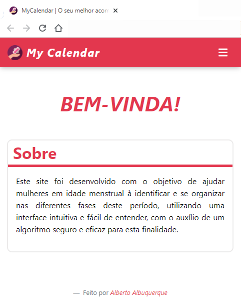

# MyCalendar

# ⚠ -- Projeto EM DESENVOLVIMENTO -- ⚠

<!--  -->

🚀 [Acesse o site aqui!](https://allbertuu.github.io/MyCalendar/) 🚀  

## 💬 Sobre o projeto
> Este projeto foi criado com o objetivo de colocar em prática os conhecimentos adquiridos em HTML5, CSS3, Bootstrap 4 e Sass.
>
> Utilizei conceitos avançados de flexbox, grid, responsividade e estilização de uma webpage com múltiplas páginas.

## Tecnologias usadas 💻
- HTML & CSS
- Bootstrap 4
- Sass

## Fontes 💬
[Período fértil](https://www.tuasaude.com/como-calcular-o-periodo-fertil/)  
[Ciclo menstrual](https://www.tuasaude.com/ciclo-menstrual/)

[⬆ Voltar ao topo](#mycalendar) 
